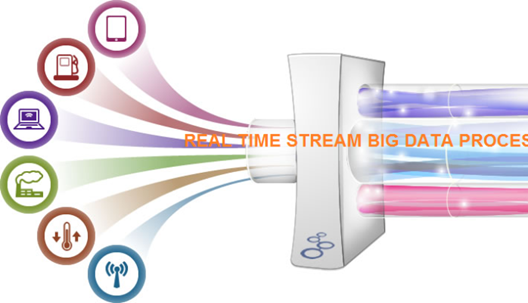
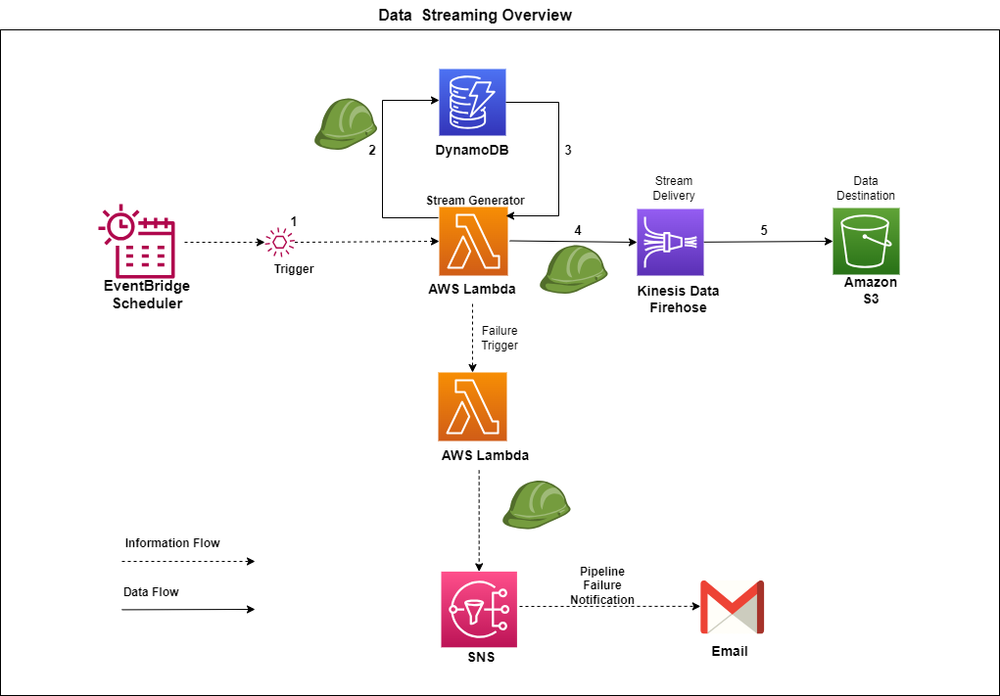
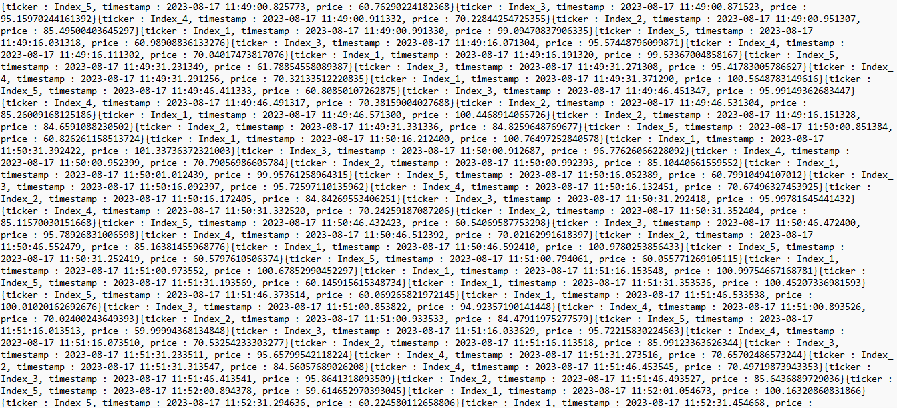

# Data Engineering: Streaming Big Data 

## Streaming data

## Introduction

<p align='center'>
     
     <br>
     <em>Figure 1:  Big Data real-time streaming.</em>
</p>

Data streams allow for continuous flow of data, providing insights in real-time and enabling timely data analysis. This is particularly important for industries such as finance, where real-time insights can help detect fraud and other security breaches.

In this project we are going to design and implement a streaming pipeline using a technology stack consisting of: 

- AWS Kinesis Firehose
- AWS DynamoDB
- AWS S3
- AWS Lambda
- AWS Simple Notification Service
- AWS Cloudwatch Events
- AWS IAM
- Python

The project simulates a streaming application for a client performing anlytics on IoT-based sensor data streams and to complete the project we need to set up a mock streaming source of our own.


<p align='center'>
     
     <br>
     <em>Figure 2:  Achitecture diagram of the system.</em>
</p>


### Step 1: Establishing Prerequisites  

There are some prerequisite configuration processes that we need to keep in mind in order to develop your streaming data pipeline:

1. **Ensure you have access to an AWS account and IAM role with Admin privileges**: All of the services used during this second task will require some form of policy authorization before being deployed correctly. As such, having access to an IAM role and AWS account which has admin privileges is vital to complete this task. 

2. **Select the correct AWS region**: Your boss reminds you that all work completed needs to take place within the `eu-west-1` AWS region.

3. **Conform to an appropriate naming convention**: Again, as a means to easily see our deployed resources in this task, we use a consistent naming convention. Here, each service resource you configure should be named: **"DE{first 3 letters of your name capitalised}{first 3 letters of your surname capitalised}-{name of service}"**. For example, when configuring a streaming lambda, and having the name *"KYLE MAPOSA"*, the applied service name would be *"DEKYLMAP-streaming-lambda"*.   

### Step 2: Setting Up a Streaming Source

The first thing to consider for the infrastructure is the stream source/generator. To produce mock streaming data we are going to use this script, provided [here](code/part2/student_streaming_lambda.py). The script simulates ticker data being fetched from financial APIs monitoring stock market movements and will take the form of an AWS Lambda function which is triggered at regular intervals to form a stream of ticker data.  

The provided script reads from a specified table within the DynamoDB service of AWS, and extracts values associated with five fetched indexes. These index values are randomly updated by a small amount, and are again then written back into the DynamoDB table, ready to repeat the process over again. Based on intuition, we can realise that the DynamoDB table must have the following item structure:

```json
Item_1 :[
    {key: "TickerName", value: "Index_1"},
    {key: "Price", value: 100}
],

Item_2 :[
    {key: "TickerName", value: "Index_2"},
    {key: "Price", value: 90}
],

Item_3 :[
    {key: "TickerName", value: "Index_3"},
    {key: "Price", value: 80}
],

Item_4 :[
    {key: "TickerName", value: "Index_4"},
    {key: "Price", value: 70}
],

Item_5 :[
    {key: "TickerName", value: "Index_5"},
    {key: "Price", value: 60}
]    
```

For each item above, the `TickerName` field caries the name of the index that is extracted by the script, and the `Price` field carries the initial value of each index that is incrementally updated during each iteration of the script.

And for the script to work as part of the data pipeline we need to perform the following actions: 
  
  1. **Create a DynamoDB table** that contains the items indicated above. This table should be named using the naming convention ending with `-streaming-dynamodb` (e.g. `DEKYLMAP-streaming-dynamodb`). 
  
  2. **Configure the script as an AWS Lambda** code  which references the DynamoDB table that created. Again, we use the project naming convention, ending with `streaming-lambda` (e.g. `DEKYLMAP-streaming-lambda`). 

  3. **Create an IAM Policy and Role** which allows the created lambda to run successfully and access the dynamodb. 

Once we've performed these actions, we should be able to run our lambda manually and see the initial values we've entered into the DynamoDB table automatically update. 
| 


### Step 3: Configuring a Lambda Trigger

In the last step the lambda function is run manually, unfortunately, executing this script manually on a continual basis just isn't practical. For this reason, we need to configure a trigger for lambda which will run it on a periodic basis. 

For this we use the AWS CloudWatch service to configure a CloudWatch-based trigger that will run your lambda data generation function every 60 seconds. Furthermore, as this is just a prototype project, we need to *only invoke the lambda function every 60 seconds* in order to reduce costs.                      |


### Step 4: Add Alerts for Lambda Failures

One of the central principles in data engineering is observability hence we need to equip our growing pipeline with some monitoring functionality. As a first step, we create an AWS SNS notification that sends a custom email to one or more email addresses whenever the configured lambda-based script stops functioning correctly. 

For this we'll create a second lambda script that will be called by the streaming lambda function if it ever fails to run fully. This short python script will call the SNS service to send a custom message to a given topic when invoked. This topic can then be configured to send an email to any confirmed email addresses when it receives a message. 

To put this notification solution in place, we need to complete the following actions:

  1. **Set up an SNS topic with an email endpoint**. This topic will cause emails to be generated whenever it receives a message from a source service (such as the notification generated by your notification lambda function). We will follow the naming convention, calling the SNS topic with "-streaming-sns-topic" appended (e.g. *"DEKYLMAP-streaming-sns-topic"*).

  2. **Convert the script into a lambda function**. The completion step requires specification of the AWS ARN of the SNS topic created, as well as giving your full name (so that your boss can easily identify that its your pipeline that fails...). Once completed you'll need to set this script up as an AWS lambda function, along with a relevant IAM policy and role that will enable its execution. For ease of identification, we name this lambda function with the task naming convention, followed by *-notification-lambda* (e.g. *"DEKYLMAP-notification-lambda"*)

  3. **Configure your streaming lambda to trigger the notification lambda upon failure**. This triggering process should be done via the AWS Lambda Dashboard, and is configured to occur in an asynchronous manner.       
 |

### Step 5: Connect AWS Kinesis Firehose to Streaming Service

With the notification lambda set up, we now have only one major component of the streaming pipeline to configure - the streaming application itself! The role of this application is to receive data streamed from a source, and to transfer this in a reliant manner to a down-stream storage destination. 

 AWS Kinesis offers a simple solution to receive a stream of data and to place this into S3-based object storage. We also need to provide public access to the destination S3 bucket we configured in order to allow provision of live demos to current and future clients.

To achieve this we take the following actions: 

  1. **Create an AWS Kinesis Firehose delivery stream with an S3 bucket end-point**. To make our destination bucket easy to find, we use the task naming convention, using your full name to ensure global uniqueness, followed by *"-deliverystream-s3"* (ex. *"dekylemaposa-deliverystream-s3"*). For the kinesis delivery stream you create, we also follow the standard task naming convention, followed by *'-deliverystream'*, e.g. *'dekylmap-deliverystream'*.

  2. **Update the destination bucket permissions to make it publicly accessible**. This update of privacy settings should allow any authenticated AWS account to have full read (NOT write) privileges for the bucket. 

  3. **Update the streaming lambda function to place the generated data into the configured delivery stream**. 

### Step 6: Test your Streaming Pipeline

After deploying the updates made to the streaming lambda - it should push data through to Kinesis Firehose and subsequently your S3 bucket. Navigating to your S3 bucket and inspecting its contents it should now have a growing collection of ticker data which grows every minute as the streaming lambda is triggered. After opening the folders and files in s3 we should get a file similar to the one below. 

<p align='center'>
     
     <br>
     <em>Figure 3:  S3 bucket contents.</em>

Seeing this, your boss walks over to give you a big high-five. You've done a fantastic job and have really impressed her and the team. However, as a final lesson for the day, your boss mentions that it's just as important to ensure that the monitoring functionality works, protecting you from being blind-sided if the system fails. To do this test, she suggests that you break your streaming lambda function by commenting out a large portion of code. After waiting for a short while, you should then start seeing email notifications within your inbox, indicating that the streaming application has failed.

 Furthermore, when breaking your streaming lambda code as suggested above, you should start receiving SNS-based alert emails after a couple of minutes indicating that your pipeline has failed. If you see these messages, as well as the incrementing content in your S3 bucket, then your pipeline is functioning correctly - well done! |


### Step 8: Environment Teardown

|    🚩 **Tear Down** 🚩    |
| ------------------------------------ |
|  Once you've ensured that your pipeline is working (based on the observations in the previous step), proceed by deleting all of the resources you've configured. |


|    💸 **Infrastructure Cost** 💸    |
| ------------------------------------|
|  Even though the majority of resources set up within this project are in the AWS free tier, it's vital that we shut them down carefully. Missing this step can mean that long-running resources exceed their free-tier quota, and result in unforeseen account charges being incurred! |
